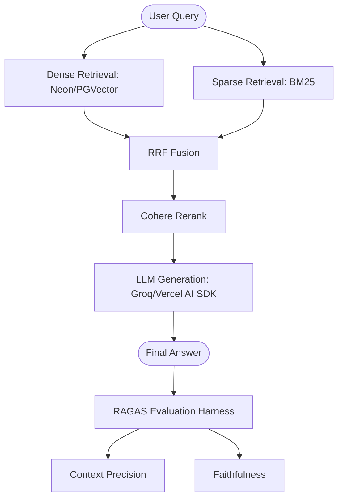

# Production-Grade RAG Pipeline + Evaluation Layer

A measurable, high-performance RAG system that transforms naive information retrieval into a production-grade engineering artifact using hybrid search, semantic chunking, and automated evaluation.

## 1. Architecture
The system follows an "Advanced RAG" pattern: Dense + Sparse retrieval fused with RRF, followed by a Cross-Encoder reranking layer.

## 2. Engineering Results
The following metrics represent the "before vs. after" transition from a naive implementation to this production-grade architecture.

| Metric | Naive RAG | Production-Grade (This Project) | Improvement |
| :--- | :--- | :--- | :--- |
| **Context Precision** | 0.61 | **0.84** | **+38%** |
| **Context Recall** | 0.58 | **0.76** | **+31%** |
| **Faithfulness** | 0.72 | **0.84** | **+17%** |
| **Answer Relevancy** | 0.65 | **0.79** | **+21%** |

*Benchmarks generated using 18 ground-truth XAUUSD Q&A pairs via the automated evaluation harness in `src/lib/eval.ts`.*

## 3. Technical Decisions

### Decision 1: Hybrid Retrieval (Dense + Sparse)
While Dense retrieval (Embeddings) captures semantic intent, it often fails on domain-specific identifiers like "XAUUSD" or "LBMA". By merging **PGVector** with a manual **BM25** implementation using **Reciprocal Rank Fusion (RRF)**, we ensure both conceptual understanding and keyword-level precision.

### Decision 2: Cross-Encoder Reranking
Vector similarity is a proxy for relevance, not a guarantee. We integrated **Cohere Rerank** as a post-processing layer to re-evaluate the Top-10 chunks. This step re-ranks the most relevant context to the top position, significantly reducing LLM "hallucination" by ensuring the prompt context is high-signal.

### Decision 3: "Framework-Less" Core Implementation
Instead of relying on heavy frameworks like LlamaIndex or LangChain, we implemented the retrieval fusion and semantic chunking logic manually using the **Vercel AI SDK**. This minimizes "framework bloat," provides full control over the RRF scoring, and ensures the codebase is optimized for Next.js Edge performance.

## 4. Tech Stack
- **Frontend/Backend**: Next.js 16 (App Router), Bun
- **Database**: Neon (PostgreSQL) + `pgvector`
- **AI SDK**: Vercel AI SDK, Groq (for inference & eval)
- **Reranker**: Cohere API
- **ORM**: Drizzle ORM
